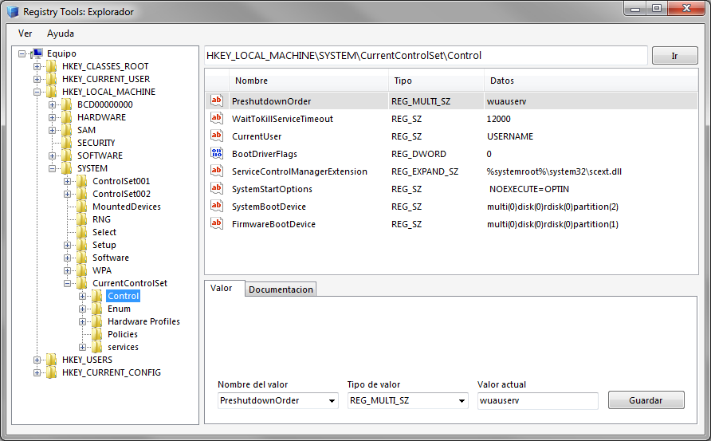
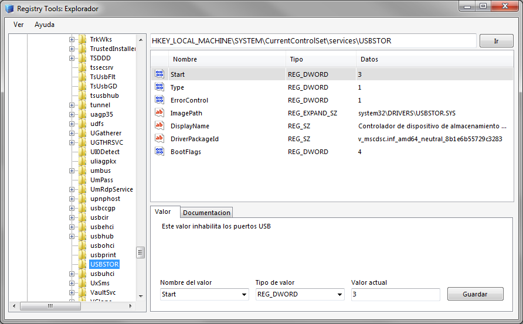
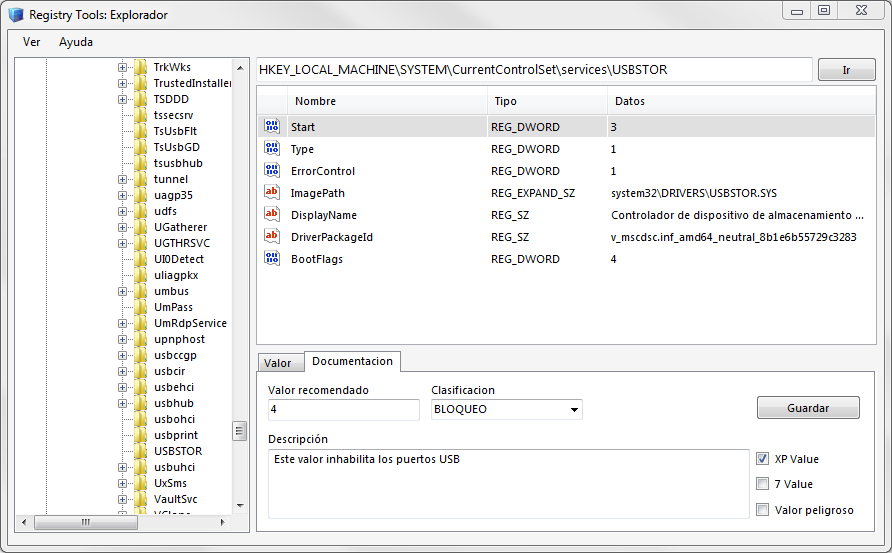

# Registry Tools

Permite realizar ajustes al registro del sistema Windows mejorando su desempeño o limitando los privilegios del usuario. Cuenta con una base de datos de ajustes prestablecidos que permite agregar ajustes adicionales.

## Empezando

Estas instrucciones te ayudaran a obtener una copia del proyecto para propósitos de desarrollo e incluye una versión compilada para ejecutar en tu sistema.

### Requisitos previos

Este proyecto fue creado para Windows XP y posteriormente adaptado para Windows 7 SP1 con Framework v4.5.1. 

### Instalación

Este software es portable y se ejecuta sin requerir instalación. Sin embargo, como modifica valores del sistema es necesario ejecutarse con privilegios de administrador.

Dentro del directorio raíz se encuentra la versión ejecutable

```
Registry Tools/bin/Debug/Rtools.exe
```

## Descripción del programa

La aplicación permite explorar el registro de sistema, documentar, crear y modificar valores existentes

### Explorar

Permite navegar entre las llaves de registro de sistema expandiendo las carpetas en el panel lateral izquierdo. Cada valor se muestra en una tabla del lado derecho. Y en la parte superior de esta, se encuentra una barra de navegación donde se puede acceder a una ruta especifica con el botón “Ir”

### Modificar

En la parte inferior derecha se encuentran dos pestañas la primera de ellas se llama “Valor” esta contiene el nombre, el tipo y el valor actual. Para cambiar el tipo o el valor del registro solo habrá que modificar estos campos y presionar el botón “Guardar”

### Crear

Para crear un nuevo registro bastara con llenar los campos nombre, tipo y valor actual con el nombre de un registro que no exista y presionar el botón “Guardar”

### Documentar

Al interior de la pestaña “Documentacion” usted puede definir un valor recomendado, escribir una descripción y clasificar el registro que se encuentre seleccionado. Presionando el botón “Guardar”

## Herramientas usadas

* [MS Visual Studio 2012](https://www.visualstudio.com/es/vs/older-downloads/) - IDE utilizado
* [MS Access 2007](http://office.microsoft.com/access) - Gestor de base de datos
* [MS Framework 4.5.1](https://www.microsoft.com/es-mx/download/details.aspx?id=40779) - Entorno de trabajo

## Referencias técnicas
* [Registry Reference](https://msdn.microsoft.com/en-us/library/ms724880.aspx) - Microsoft Developer Network

## Contribuyendo

Por favor lea [contribuyendo](https://gist.github.com/PurpleBooth/b24679402957c63ec426) para obtener detalles sobre nuestro código de conducta y el proceso para enviarnos solicitudes de integración.

## Autores

* **Angel González** - *Trabajo inicial* - [mgrc45](https://github.com/mgrc45)

Vea también la lista de [contribuyentes](CONTRIBUTORS) que participaron en este proyecto.

## Licencia

Este proyecto está licenciado bajo la licencia GNU General Public License v2.0. Consulte el archivo [licencia](LICENSE) para obtener más información.

## Capturas de pantalla
<p>



</p>
